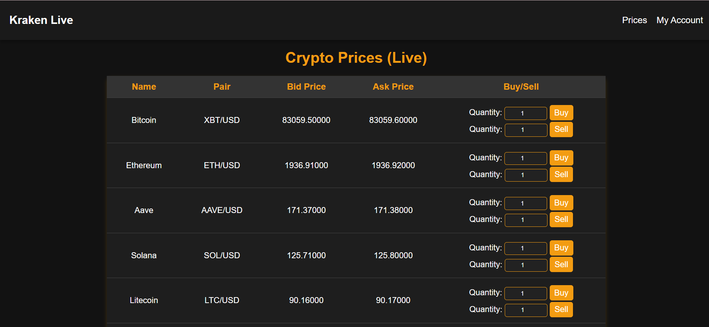

# Crypto Trading Simulator

Crypto Trading Simulator is a Spring MVC application that provides real-time visualization of cryptocurrency prices. The
platform enables users to simulate trading by offering essential functionalities such as:

1. Live price updates for various cryptocurrencies
2. Buy and sell simulation
3. Reset account to start fresh

## Tech stack

1. **Java 17**
2. **JavaScript**
3. **Thymeleaf**
4. **HTML**
5. **CSS**
6. **Gradle**

## ✅ Setup and Running

### External API

**[Cryptocurrency API](https://docs.kraken.com/api/docs/websocket-v2/ticker)**
This API provides real-time cryptocurrency prices. We use WebSocket to fetch live market data efficiently.

## H2 Database Configuration

We use an H2 in-memory database, so there's no need to modify environment variables. However, if you want to change the
database name, username, or password, you can update the following values in the application.properties file:

````
spring.h2.console.enabled=true
spring.h2.console.path=/h2-console
spring.datasource.url=jdbc:h2:mem:testdb
spring.datasource.driverClassName=org.h2.Driver
spring.datasource.username=sa
spring.datasource.password=sa
spring.sql.init.platform=h2
spring.jpa.database-platform=org.hibernate.dialect.H2Dialect
spring.jpa.hibernate.ddl-auto=update
````

You can access the H2 database console at:

http://localhost:8080/h2-console

After opening the console, enter the following credentials:

JDBC URL: jdbc:h2:mem:testdb
Username: sa
Password: sa
This will allow you to interact with the database directly.

## Running the Application

The application runs on a local server at port 8080.
Follow these steps to start it:

1. Build with Gradle
2. Run the application from your IDE
3. Open http://localhost:8080/crypto in your browser.

# About the Project

### Home Page

The homepage features a navigation bar where users can view real-time cryptocurrency prices or access their My Account
section. It displays the top 20 cryptocurrencies with live price updates.
To optimize performance, JavaScript connects directly to the Kraken API via WebSocket, reducing the need for constant
backend requests. However, when users click the Buy or Sell buttons, a request is sent to the backend to fetch the
latest price again and perform validation. This ensures that the transaction price is as accurate as possible.





* Buy/Sell Validations

1. Insufficient Balance: A specific message is displayed if the user doesn't have enough funds to complete the purchase.
2. Invalid Quantity: A specific message is shown if the entered amount is not valid.
3. Price Change >1%: If the price fluctuates by more than 1% during the transaction process, a message is displayed.
4. Successful Transaction: A confirmation message is displayed when the transaction is completed successfully.
5. Insufficient Holdings: If the user does not own the selected cryptocurrency or does not have enough of it, a
   specific message is displayed.


#### Invalid transaction due to insufficient funds.


#### Quantity validation. Expected to be a positive number.


#### Validation to prevent selling currency that the user does not own.


#### Successful transaction buy/sell


### My Account Page

In My Account, users can view their Transaction History, which includes records of purchases and sales, as well as their current balance, which always starts at $10,000. When a user buys or sells currency, the balance updates accordingly.
The Balance State shows the total value if the user sells all the cryptocurrencies they own at the current market price, combined with their current cash balance in USD. The amount updates in real-time as the market price changes. It indicates whether the user is in a profit or loss, and by how much.

The Reset button allows users to reset their account, which clears all transaction history and restores the balance to $10,000.

#### The initial state of the account before any purchases or sales.


#### The state of the account after purchases or sales.

